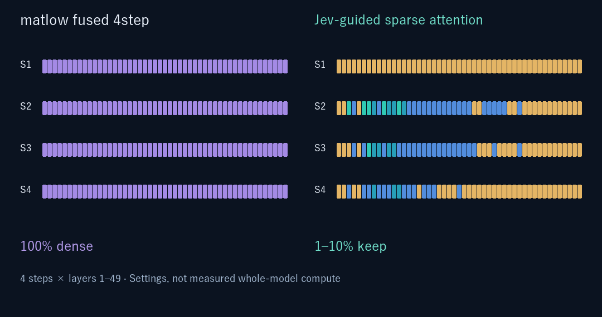

# 009jev：Jev-guided native SLA

[English](009JEV.en.md) · 実験ブランチ `exp/jev-adaptive-vsa`

**009jevを本ブランチの正式な実験手法として収録しました。** 通常のMiniMax H3モデルロード・線形計算・FastVAEを維持し、標準SLAの層別keep率を初回からJevに選ばせます。ノードIDは `H3JevNativeSLAPatch`、表示名は **009jev: Jev-guided Native SLA**。旧W4A4/VSA制御とは別経路で、FC1 W4A4変換・preconverted gate・VSA cube tilingを使用しません。mainには含めません。

## 必要な環境

Windows / RTX4070 12GB / ComfyUI0.36.0で実生成。確認したComfyUI commitは `7a0b5eede3f9721c8faab290689893f36edc6d66`。内部API `comfy_extras.nodes_sparse_attention`、native MiniMax H3の50blocks、comfy-kitchenのSLA経路を使用します。他のモデルや任意のsampler向けではありません。**4step / res_multistep**専用です。

例の通常モデルは `minimax_h3_fused_refdelta_r1024_turbo8_mystic07_int8_convrot.safetensors`、32B Qwen encoder、H3 video/audio VAE。正確な名前は例のnode127/128/119/120を参照してください。重みは同梱・自動ダウンロードしません。

例のChunkFFNは [KJNodes](https://github.com/kijai/ComfyUI-KJNodes)、FastVAEは [MotionCache-FastVAE](https://github.com/Mozer/ComfyUI-MiniMax-H3-MotionCache-FastVAE) が必要です。MotionCacheによる出力再利用は使いません。

## 導入：重み変換は不要

既存の専用ComfyUIのcustom_nodesに、本ブランチをcloneしてください。すでに同じリポジトリがある場合は重複cloneせず、そのコピーを本ブランチへ更新してください。

```powershell
# 作業場所：対象ComfyUIのcustom_nodes
git clone --branch exp/jev-adaptive-vsa --single-branch https://github.com/sepiablue-ai/ComfyUI-MiniMax-H3-W4A4-VSA.git
cd ComfyUI-MiniMax-H3-W4A4-VSA
py -3.10 -m venv .venv-jev
& .\.venv-jev\Scripts\python.exe -m pip install -r requirements-jev.txt
```

この方法ならSDKは専用venvだけに入ります。**009jevだけを使う場合、W4A4向けsetup.bat/setup.ps1やconvert.pyは実行不要**です。これらは旧経路用でgateや変換を要求します。既存installerの配布対象には新モジュールも含めていますが、installer自体はW4A4用です。

ComfyUIを再起動し、ノードの `sdk_python` に専用venvのPythonの絶対パスを指定。空欄はComfyUIのPythonを使うため、SDKを別venvへ入れた場合は必ず指定してください。APIキーはComfyUI起動プロセスの `TYPESAFE_API_KEY` 環境変数からだけ取得します。[キーをファイルや履歴に残さない起動例](JEV_ADAPTIVE.md#apiキーをファイルに書かず起動する)を参照。ワークフローやコードへキーを書かないでください。キー欠落・Pythonパス不正は実行前にエラーにします。

## 再現用ワークフロー（API形式）

- [通常版：matlow fused 4step](examples/matlow_fused_4step.api.json)
- [009jev：保存済み過去統計を初回判断へ渡す実測構成](examples/009jev_4step.api.json)
- [009jev：過去統計なし・promptのみで初回判断](examples/009jev_cold_start.api.json)

**API形式**なので通常のGUI用JSONとは異なります。各自の参照画像3枚を `ComfyUI/input/jev_reference_01.png`〜`03.png` として用意するか、LoadImageの名前を変更してください。順序は同じ人物の全身・上半身・顔。モデル/VAE/encoder名も手元のファイル名へ合わせます。画像とモデルの権利はそれぞれの条件に従ってください。

Jev版のnode900 `sdk_python`を設定し、既存ComfyUIへ送る例：

```powershell
$jevGraph = Get-Content -Raw -Encoding UTF8 .\examples\009jev_4step.api.json | ConvertFrom-Json
$jevGraph.'900'.inputs.sdk_python = (Resolve-Path .\.venv-jev\Scripts\python.exe).Path
$jevBody = @{prompt=$jevGraph} | ConvertTo-Json -Depth 100
Invoke-RestMethod -Uri 'http://127.0.0.1:8188/prompt' -Method Post -ContentType 'application/json; charset=utf-8' -Body ([Text.Encoding]::UTF8.GetBytes($jevBody))
```

ポートは起動済みComfyUIに合わせてください。この例は1回の投入だけです。返されたprompt_idを控え、完了通知後に履歴を確認してください。不確実な応答を理由に同じジョブを再投入しないでください。

新しいpromptに変える場合、生成ノード131のpromptとnode900の `prompt_context` を同じ本文に変更します。過去統計の出所や条件が違うなら `initial_context` も差し替えるかcold-start例を使います。古い統計を現在の観測として扱わないでください。`prompt_context` は `initial_context.prompt` より優先されます。

## Jevが決めるもの

Jevは各層の **1/3/5/10% keep率**を選び、具体的なattention接続はSLAが選びます。初回はpromptと任意の過去統計を渡し、50層を一括判断。層0の初回候補は5/10%です。現在の映像や初回残差を先読みするわけではなく、追加probe forwardもありません。

2〜4stepでは直前stepの音声/動画それぞれ64token×16channelから相対残差、層内順位、残差のstep間変化を渡します。49層（1〜49）を判断し、層0は5%固定。**モデルは全50層を毎step実行**します。図が49層なのは表示範囲です。

初回confidence0.3未満は10%、後段は5%へ戻します。API/回答検証失敗で回路を閉じ、初回失敗は10%、後段失敗は5%を維持。SDKはjev-1.13.0、timeout20秒、retry0、4stepで最大4回。`fixed5`/`fixed10`は**初回だけ**の診断モードで、後段のAPIは動きます。通常の009jevは `jev_first`。

音声queryや条件KV等はSLA側で別途保護され、keep1%は全計算量1%ではありません。SLAの内部統計状態は標準実装を使用しますが、過去のblock出力を再利用するactivation cacheではありません。文字の欠落や音質を直接評価するOCR/MOSは渡していません。

APIへ送るのはprompt本文、供給した過去統計、集約した層統計など。生の画像・音声・モデル重みは送信しません。ログ `[009jev]` には判断state・回答・usageが含まれるため、prompt内容はログにも残ります。APIキーやHTTP例外本文は記録しません。

## 採用した実測

|同条件・各1回|全生成|表示時間|
|---|---:|---|
|matlow fused 4step|366.720秒|06:07|
|009jev|213.890秒|03:34|

RTX4070、1024×1792、124f/24fps、seed2026、4step。41.675%短縮。モデル読み込み・Jev待機・VAE・保存込み。**SLA＋Jev方式全体の効果であり、固定SLAに対するJev単独の優位を測った値ではありません。** 品質同等性は未認定。

手を伸ばす旧promptでは余分な指が出たため、ユーザー指定で手を下ろしてうなずくpromptへ変更し、両方式を再生成しました。採用条件と除外経緯は[実測JSON](docs/009jev/measurements.json)に記録。モデル・参照画像・動画は同梱しません。



図はkeep設定値で、実際に選択された全接続マスクや総計算削減率ではありません。

## 検証

```powershell
& <ComfyUI-Python> -B -X utf8 test_native_sla.py --comfy-root <ComfyUI-root>
& <ComfyUI-Python> -B -X utf8 test_adaptive.py
```

初回50回答、後段49回答、confidence補正、API回数、失敗時回路遮断、秘密情報を含む例外本文を出さないこと、参照tokenを観測から除くこと、通常/009jev例の設定一致をオフラインテスト。実生成は元のローカル実装で完了し、公開時には登録・移植性・入力検査を整理しています。公開準備で追加の有料API・動画生成はしていません。
